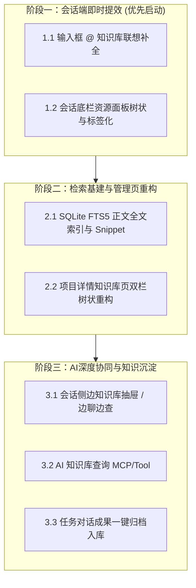

# 项目知识库优化与检索升级方案设计 (KB Enhancement Plan)

## 一、 背景与核心痛点

当前 CodeG 二次开发中已落地了基础的知识库（`_knowledge/` 目录规范、数据库记录、Scanner 扫描与底栏关联注入）。然而随着文档和文件数量增加，在实际开发协同中暴露出以下核心痛点：

1. **会话场景下查找与引用阻断感强**：日常在与 AI 对话时，引用知识库需要打断打字，点开底部弹窗并在单一大列表中手动翻找，操作链路长。
2. **检索能力局限**：目前仅支持元数据（标题、标签、描述）的 SQL `LIKE %keyword%` 匹配，缺乏正文全文检索，记不清文件名或未写 frontmatter 时无法精准召回，也无上下文高亮（Snippet）。
3. **界面展示扁平**：管理页与选择器均采用平铺展示，多层级子目录（如 `docs/api/v1/auth.md`）失去结构感，难以按分类浏览。
4. **协同链路被动且单一**：仅支持人工在创建任务对话时勾选，AI 无法在会话过程中根据需要自主查阅知识库，任务产生的关键技术决策也缺乏一键归档沉淀的闭环。

---

## 二、 架构设计原则：防合并冲突 (Conflict-Proof Architecture)

作为上游开源项目的二次开发分支，系统必须随时保持与官方仓库（Upstream）同步演进的能力。因此本方案遵循以下原则：

```
┌────────────────────────────────────────────────────────┐
│  官方主干核心 (Upstream Core - 保持极低侵入)           │
│  - message-input / rich-composer / types.ts            │
└──────────────────────────┬─────────────────────────────┘
                           │ 轻量挂载 / 扩展插槽
┌──────────────────────────▼─────────────────────────────┐
│  二次开发扩展层 (Platform Extension - 独立模块)        │
│  - src/lib/platform/kb-suggestion.ts (知识库补全适配)   │
│  - src/components/platform/kb-picker/ (树状选择器)     │
│  - src-tauri/src/platform/knowledge/fts.rs (FTS5全文)  │
│  - src-tauri/src/db/migration/m2026... (独立数据库迁移)│
└────────────────────────────────────────────────────────┘
```

1. **独立模块隔离**：核心业务逻辑（树状解析、FTS5 检索、Mention 适配）均编写在 `src/lib/platform/`、`src/components/platform/` 和 `src-tauri/src/platform/` 等二次开发专属路径下。
2. **复用既有扩展协议**：复用既有的 `ReferenceKind = "context"` 及 `ReferenceMeta` 结构，不破坏上游 ProseMirror schema 定义。
3. **独立 Migration 递增**：数据库全文索引等改动使用独立有序的 SeaORM migration 文件，避免修改已有 migration。
4. **单点挂载与轻量 Hook 包装**：对主干文件的改动仅限于必要的数据源传参挂载，将冲突概率压缩至最低。

---

## 三、 分阶段实施规划



---

### 阶段一：会话端即时提效（解决打字中断与查找慢）

#### 1.1 输入框 `@` 知识库联想补全
* **目标**：在 Chat 输入框中键入 `@` 或 `@kb:` 时，自动弹出当前项目的知识库文档列表，支持标题/拼音/标签模糊搜索。
* **详细设计**：
  * **新增** `src/lib/platform/kb-suggestion.ts`：
    * `kbDocToSuggestion(doc: KnowledgeDocInfo): SuggestionItem`
    * 将知识库文档格式化为 Suggestion 项，携带 `refType: "context"`, `injectGroup: "kb_doc"`, `injectDocPath`, `injectDocId` 等属性。
  * **扩展** `@` 建议提供者：在支持会话的项目上下文中，把当前已加载的 `kbDocs` 作为建议源组合进 `SuggestionGroup`（分组名为 `📚 知识库文档`）。
  * **徽章渲染**：在 `reference-badge.tsx` 中将 `injectGroup === "kb_doc"` 的徽章渲染为专属知识库图标 `[📚 文档标题]`。

#### 1.2 会话底栏资源弹窗（Popover）树状与分类化
* **目标**：重构会话底栏资源关联面板，将平铺文档转化为可折叠的多级目录树与标签矩阵。
* **详细设计**：
  * **新增** `src/components/platform/kb-tree-picker.tsx`：
    * 接收 `kbDocs` 列表，根据 `filePath` 自动构成分类树（`docs/`、`templates/`、`requirements/` 等）。
    * 提供按分类节点一键展开/折叠、全选/取消勾选子项的能力。
    * 顶部提供即时搜索框（根据标题与路径过滤）与标签（Tags）过滤条。
  * **集成替换**：在 `src/components/platform/task-context-popover.tsx` 中将平铺列表替换为 `KbTreePicker`。

---

### 阶段二：检索基建与管理页重构（解决找不到与平铺混乱）

#### 2.1 SQLite FTS5 正文全文索引与 Snippet 高亮
* **目标**：支持正文内容的高性能全文搜索，即使未打标签或记不清标题，也能秒级召回并提取命中摘要。
* **详细设计**：
  * **数据库迁移**：新增 migration 创建 `platform_knowledge_doc_fts` 虚拟表（采用 FTS5 + trigram 或 unicode61 tokenizer）。
  * **Scanner 增强**：在 `src-tauri/src/platform/knowledge/scanner.rs` 扫描文档时，读取正文内容并同步写入/更新 FTS 索引。
  * **后端检索接口**：在 `src-tauri/src/platform/knowledge/fts.rs` 中封装基于 SQLite FTS5 的搜索函数，返回匹配结果及带 `<mark>` 标签的 `snippet` 摘要。
  * **前端高亮呈现**：搜索结果展示命中的正文上下文片段。

#### 2.2 项目详情页-知识库管理双栏重构
* **目标**：将平铺列表升级为现代知识库双栏结构。
* **详细设计**：
  * **左侧栏**：多级文件树 + 标签云（Tag Cloud）复合筛选 + 文档数量角标。
  * **右侧栏**：
    * 默认浏览态：Markdown 即时预览 / 元数据展示；
    * 搜索态：展示全文检索匹配列表（包含高亮摘要），点击某项直接在右侧定位打开。

---

### 阶段三：AI 深度协同与知识沉淀（解决被动查与只出不进）

#### 3.1 会话侧边知识库抽屉
* 在 Chat 页面右上角新增“📚 知识库”抽屉图标，展开侧边悬浮面板，支持边浏览知识库目录边与 AI 对话，并支持“一键引用至输入框”或“基于该文档提问”。

#### 3.2 AI 知识库查询 MCP/Tool
* 为 Agent 注册系统工具 `search_project_knowledge` 和 `read_knowledge_doc`。
* 当用户提出复杂业务问题且未显式引用文档时，AI 可自主调用工具查询相关规范，实现真正的主动感知。

#### 3.3 任务对话成果一键归档入库
* 在任务完成或对话详情处增加“沉淀为知识”按钮，AI 自动提炼对话中的核心技术方案并生成规范的 Markdown（附带 YAML frontmatter），一键写入 `_knowledge/docs/`。

---

## 四、 实施检查清单 (Checklist)

### 阶段一（当前执行）
- [ ] 创建并切换至开发分支 `feature/kb-enhancement`
- [ ] 创建 `src/lib/platform/kb-suggestion.ts` 适配知识库文档到 `@` SuggestionItem
- [ ] 在 `PlatformComposerToolbar` / 会话输入层挂载知识库 `@` 补全
- [ ] 创建 `src/components/platform/kb-tree-picker.tsx` 树状折叠选择器组件
- [ ] 改造 `task-context-popover.tsx` 引入分类树与标签过滤
- [ ] 测试验证：输入框输入 `@` 联想、底栏树状选择勾选与上下文注入

### 阶段二（后续推进）
- [ ] 新建 FTS5 SeaORM migration
- [ ] 实现 `scanner.rs` 正文提取与全文索引同步
- [ ] 实现全文搜索 API 与 Snippet 高亮
- [ ] 重构 `knowledge-manager.tsx` 为双栏树状管理视图

### 阶段三（后续推进）
- [ ] 实现会话侧边小抽屉
- [ ] 注册 AI 检索 Tool
- [ ] 落地任务成果一键归档功能
